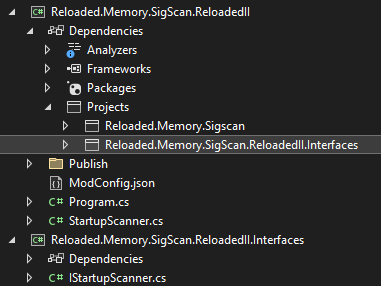

# How to Publish Dependencies

Publishing dependencies in Reloaded is done through something called `Interfaces` libraries.  
Interfaces libraries are simply libraries that contain a collection of all interfaces a mod wants to make public.  

## Create an Interfaces Library

Create a separate `Class Library` project in your solution named, `<YOUR_MOD_ID>.Interfaces` (by convention).  

Add a `Project Reference` from to this new library in your main mod.  

Your `Solution Explorer` (or equivalent) should look something like this:  



### Create a NuGet Package

!!! info

    Please note, that once you upload a package to NuGet.org, you cannot delete it, only hide it from search results.  

To make your interfaces library more accessible, it is preferable to make it a NuGet package and publish it to NuGet.org.  

To do so, add and fill the following lines to your interface project's `.csproj` file (inside the first `PropertyGroup`):  

```xml
<!-- Create NuGet Package and include your Documentation/comments inside. -->
<GenerateDocumentationFile>true</GenerateDocumentationFile>
<GeneratePackageOnBuild>True</GeneratePackageOnBuild>

<!-- Set to the same as your project name/namespace -->
<PackageId>Your.Namespace.Here.Interfaces</PackageId>

<!-- Use Semantic Versioning -->
<Version>1.0.0</Version>
<Authors>YourNameHere</Authors>

<!-- Description of your Package -->
<Description>Description of your mod.</Description>

<!-- Link to your Source Code [GitHub Page, etc.] -->
<PackageProjectUrl></PackageProjectUrl>
<RepositoryUrl></RepositoryUrl>

<!-- URL to the icon seen for your package in NuGet Search -->
<PackageIconUrl>https://avatars1.githubusercontent.com/u/45473408</PackageIconUrl>

<!-- SPDX License Identifier: https://spdx.org/licenses/ -->
<PackageLicenseExpression>LGPL-3.0-or-later</PackageLicenseExpression>
<PackageRequireLicenseAcceptance>True</PackageRequireLicenseAcceptance>
```

Then build the project in `Release` mode.  
When you build the interfaces project, you should now see an accompanying `.nupkg` file in the `bin` folder.  
You can then upload this file to NuGet.org.  

!!! note

    If you are using an IDE like Visual Studio, you'll most likely be able to edit these properties from a `Properties` / `Project Settings` window.

## Create Interfaces

Create the interfaces for each of the public APIs that you wish to expose to other mods.  

A quick way to do this (in many IDEs) is to hover your text cursor over a class name and apply the `Extract Interface` Quick Fix/option.  


An example interface:  

```csharp
/// <summary>
/// Represents an individual scanner that can be used to scan for byte patterns.
/// </summary>
public interface IScanner : IDisposable
{
    /// <summary>
    /// Attempts to find a given pattern inside the memory region this class was created with.
    /// The method used depends on the available hardware; will use vectorized instructions if available.
    /// </summary>
    /// <param name="pattern">
    ///     The pattern to look for inside the given region.
    ///     Example: "11 22 33 ?? 55".
    ///     Key: ?? represents a byte that should be ignored, anything else if a hex byte. i.e. 11 represents 0x11, 1F represents 0x1F
    /// </param>
    /// <returns>A result indicating an offset (if found) of the pattern.</returns>
    PatternScanResult FindPattern(string pattern);
}
```

!!! danger

    Your interfaces library SHOULD NOT contain any external references/NuGet packages/3rd party libraries.  
    You risk breaking others' mods if they end up using the same libraries.  

## Publish the Interfaces Library

All that's left is for you to publish the interfaces library.  
To do this, two steps are required.  

### Export the Interfaces

Create a class which inherits from `IExports`.  
In `GetTypes`, return an array of interfaces to be consumed by other mods.  

```csharp
public class Exports : IExports 
{
    // Sharing a type actually exports the whole library.  
    // So you only really need to share 1 type to export your whole interfaces library.  
    public Type[] GetTypes() => new[] { typeof(IController) };
}
```

### Share it with Mod Loader

During initialization (`Mod.cs`), register your interface with the Mod Loader using the `IModLoader` instance.  

```csharp
void PublishInterface() 
{
    var _controller = new Controller(); // Implements IController
    _loader.AddOrReplaceController<IController>(this, _controller);
}
```

## Disposing (Publisher)

Reloaded will automatically dispose your dependencies when your mod is unloaded.  
You can however, still manually (if desired) dispose/replace your dependency instances with the `RemoveController` method.  

```csharp
void Unload() 
{
    _loader.RemoveController<IController>();    
}
```

## Upgrading Interfaces

!!! tip

    This [Microsoft Code Analyzer](https://github.com/dotnet/roslyn-analyzers/blob/main/src/PublicApiAnalyzers/PublicApiAnalyzers.Help.md) is very highly recommended.  
    When combined with source control, e.g. 'git' it will help you keep track of the APIs your mod exposes.  


You are free to **ADD** anything to your existing interfaces at any time.  

However, after you publish an interface, you should **NEVER**:  
- Remove any parts of it.  
- Change any existing parts of it (names, parameters).  

Failure to do so will break any mods which use those methods.  

## Examples

The following mods can be used as examples.  

**Universal Mods**

- [Reloaded Universal File Redirector](https://github.com/Reloaded-Project/Reloaded.Mod.Universal.Redirector)
    - Producer: `Reloaded.Universal.Redirector`
    - Contract: `Reloaded.Universal.Redirector.Interfaces`
    - Consumer(s): `Reloaded.Universal.Monitor`, `Reloaded.Universal.RedirectorMonitor`

**Application Specific**

- [Sonic Heroes Controller Hook](https://github.com/Sewer56/Heroes.Controller.Hook.ReloadedII) (Allows other mods to receive/send game inputs.)
    - Producer: `Riders.Controller.Hook`
    - Contract: `Riders.Controller.Hook.Interfaces`
    - Consumer(s): `Riders.Controller.Hook.Custom`, `Riders.Controller.Hook.XInput`, `Riders.Controller.Hook.PostProcess`

- [Sonic Riders Controller Hook](https://github.com/Sewer56/Riders.Controller.Hook) (Allows other mods to receive/send game inputs.)
    - Producer: `Heroes.Controller.Hook`
    - Contract: `Heroes.Controller.Hook.Interfaces`
    - Consumer(s): `Heroes.Controller.Hook.Custom`, `Heroes.Controller.Hook.XInput`, `Heroes.Controller.Hook.PostProcess`

**Libraries as Dependencies**

- [PRS Compressor/Decompressor](https://github.com/Sewer56/Reloaded.SharedLib.Csharp.Prs.ReloadedII)
- [Reloaded.Hooks (Function Hooking/Detour Library)](https://github.com/Sewer56/Reloaded.SharedLib.Hooks.ReloadedII)